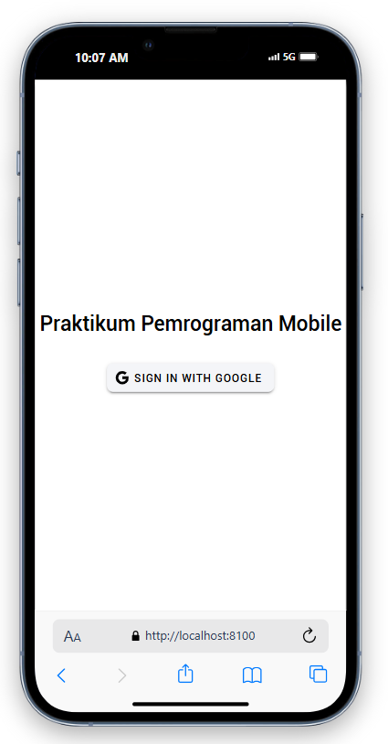
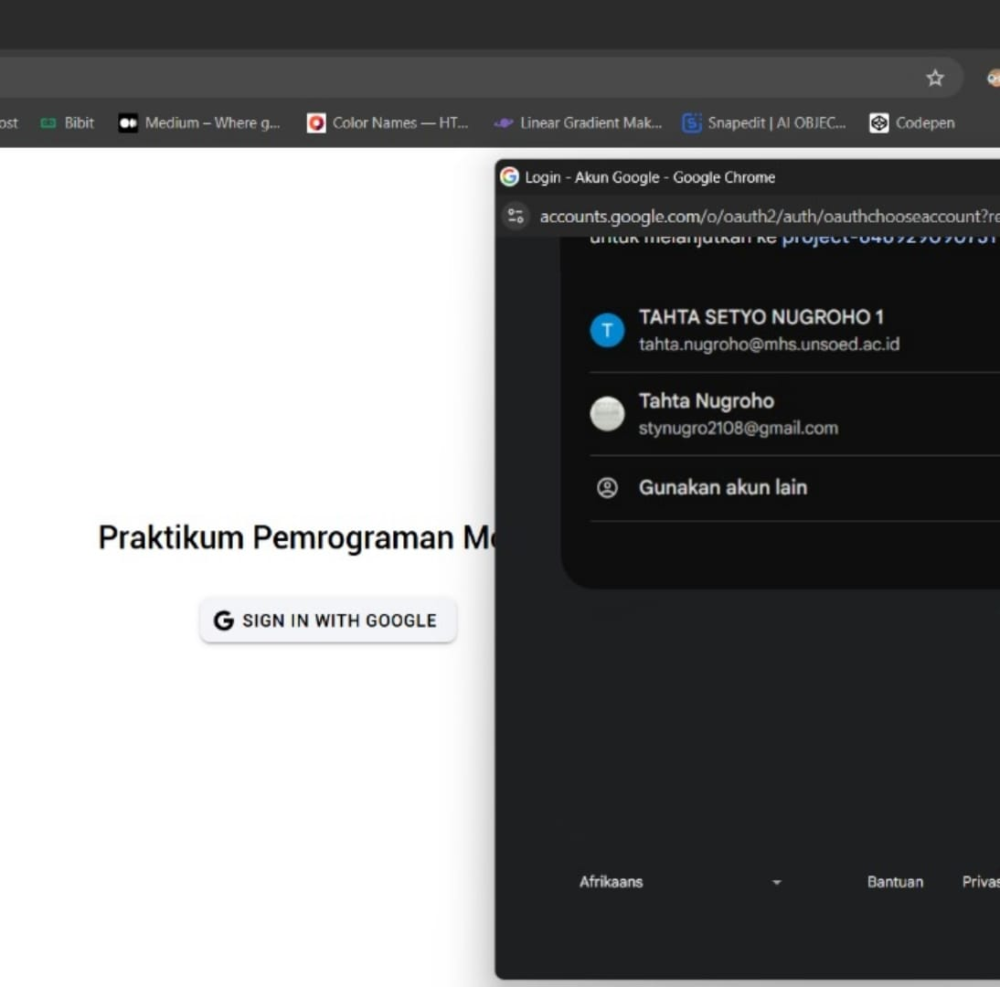
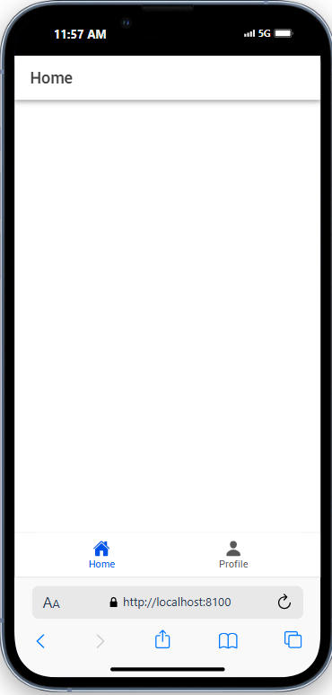
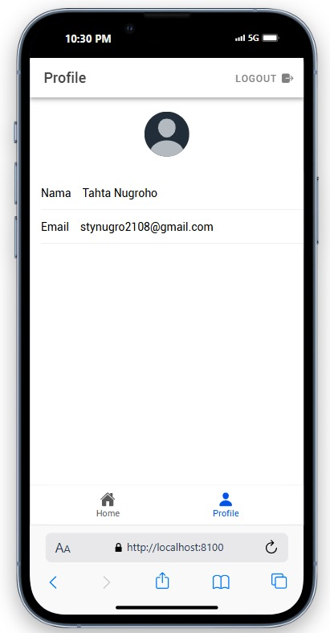
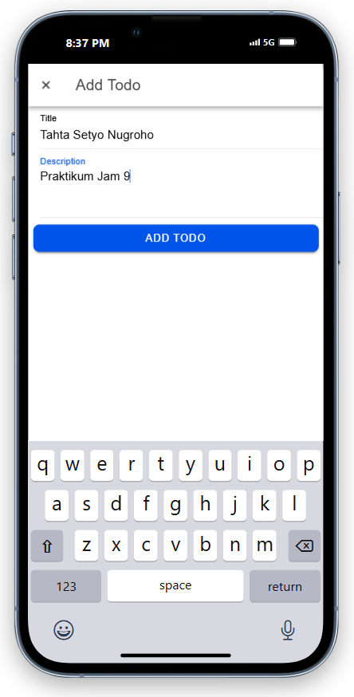
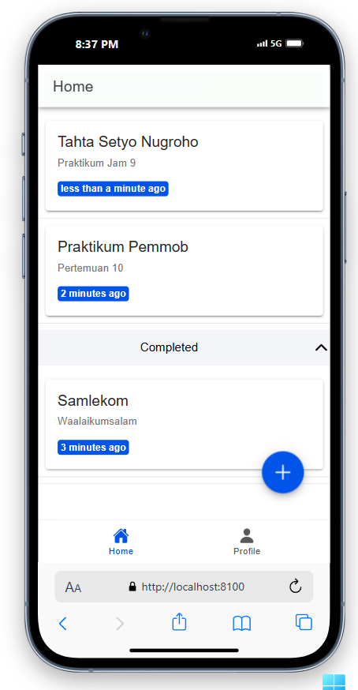
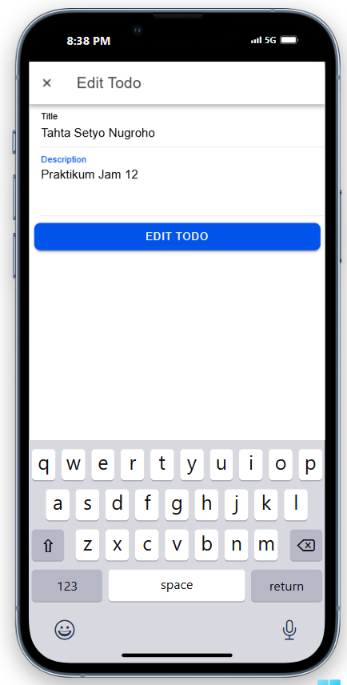
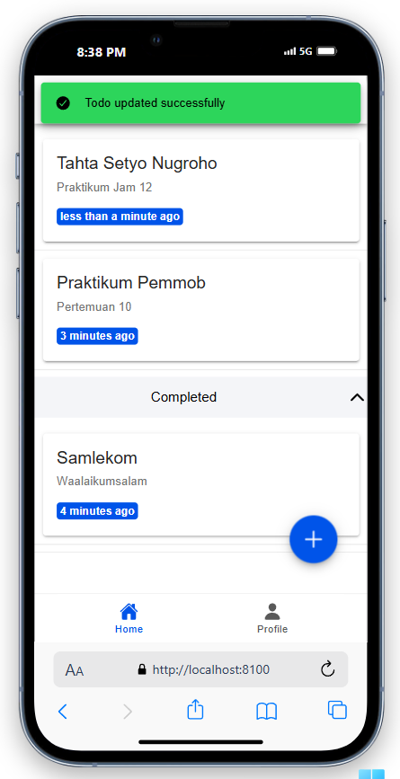
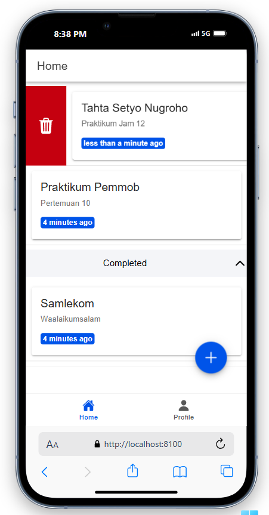
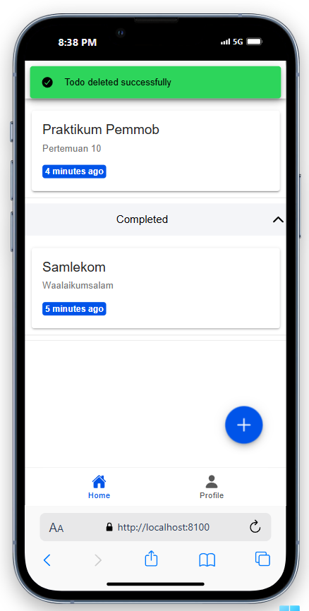

# Penjelasan Source Code

## Login Page



Ketika aplikasi diakses, pengguna akan pertama kali melihat halaman login ini. Untuk melanjutkan, klik tombol "SIGN IN WITH GOOGLE".


```template
<!-- Button Sign In -->
                <ion-button @click="login" color="light">
                    <ion-icon slot="start" :icon="logoGoogle"></ion-icon>
                    <ion-label>Sign In with Google</ion-label>
                </ion-button>
```
```script
const login = async () => {
    await authStore.loginWithGoogle();
};
```



Setelah klik tombol login, pilih akun Google yang ingin digunakan, lalu tekan "OK".

Berikut adalah Router. Jika login berhasil, pengguna akan diarahkan ke halaman Home Page, sedangkan jika gagal akan kembali ke halaman login.
```router/index.ts
router.beforeEach(async (to, from, next) => {
  const authStore = useAuthStore();
  
  if (to.path === '/login' && authStore.isAuth) {
    next('/home');
  } else if (to.meta.isAuth && !authStore.isAuth) {
    next('/login');
  } else {
    next();
  }
});
```

## Home Page




Setelah berhasil login, pengguna akan langsung diarahkan ke Home Page. Halaman ini tidak memiliki konten tambahan.

Ini adalah kode dari tampilan Home Page
```template
<ion-page>
    <ion-header :translucent="true">
      <ion-toolbar>
        <ion-title>Home</ion-title>
      </ion-toolbar>
    </ion-header>

    <ion-content :fullscreen="true">
      <div>
      </div>
      <TabsMenu />
    </ion-content>

  </ion-page>
```
Untuk membuka halaman Profile Page, klik ikon Profile di bagian kanan bawah layar.

## Profile Page



Pada halaman ini, pengguna dapat melihat foto profil, nama, dan email yang digunakan saat login.
```template
<!-- Avatar -->
            <div id="avatar-container">
                <ion-avatar>
                    
                </ion-avatar>
            </div>

            <!-- Data Profile -->
            <ion-list>
                <ion-item>
                    <ion-input label="Nama" :value="user?.displayName" :readonly="true"></ion-input>
                </ion-item>

                <ion-item>
                    <ion-input label="Email" :value="user?.email" :readonly="true"></ion-input>
                </ion-item>
            </ion-list>
```

Ini adalah script untuk menampilkan data akun
```script
const userPhoto = ref(user.value?.photoURL || 'https://ionicframework.com/docs/img/demos/avatar.svg');

function handleImageError() {
    userPhoto.value = 'https://ionicframework.com/docs/img/demos/avatar.svg';
}
```

Jika tombol Log Out di pojok kanan atas ditekan, pengguna akan diarahkan kembali ke halaman login.
```template
                <!-- Logout Button -->
                <ion-button slot="end" fill="clear" @click="logout" style="--color: gray;">
                    <ion-icon slot="end" :icon="exit"></ion-icon>
                    <ion-label>Logout</ion-label>
                </ion-button>
```
```script
const logout = () => {
    authStore.logout();
};
```
# Create


1. Saat tombol Tambah ditekan maka modal input akan muncul. Pengguna dapat mengisi data todo. Klik tombol Simpan lalu event @submit akan memanggil fuingsi hnadleSubmit(todo)
2. Di dalam fungsi tersebut nilai input akan divalidasi dahulu,jika Jika title kosong, akan muncul pesan peringatan melalui showToast. Jika validasi berhasil, fungsi akan memeriksa apakah editingId kosong. Jika kosong, fungsi firestoreService.addTodo(todo) akan digunakan untuk menambahkan data baru ke database. Setelah itu, fungsi loadTodos() dijalankan untuk memperbarui daftar todo, diikuti dengan notifikasi keberhasilan. Proses ini memastikan penambahan todo berjalan dengan baik.
# Edit


1. Saat pengguna ingin mengedit data,  memilih item todo yang ada akan membuka InputModal dengan data yang sudah dimasukkan.
2. Ketika selesai mengedit dan mengklik tombol Simpan, event @submit  memanggil fungsi handleSubmit(todo). Dengan menggunakan fungsi ini, sistem akan memeriksa apakah "editingId" memiliki nilai. Dalam hal ini, berarti pengguna sedang mengedit data. Fungsi firestoreService.updateTodo(editingId, todo) kemudian dipanggil untuk memperbarui data dalam database berdasarkan ID yang diedit.
3. Jika pembaruan berhasil, fungsi loadTodos() dijalankan dan daftar todo diperbarui untuk  mencerminkan perubahan terbaru. Pesan sukses ditampilkan melalui showToast sehingga pengguna dapat mengonfirmasi bahwa data telah berhasil diperbarui. Alur ini memastikan proses pengeditan berjalan lancar dan perubahan disimpan dengan baik.

# Delete


1. Proses penghapusan todo dimulai ketika pengguna memilih item yang akan dihapus dan mengklik tombol Hapus. Aplikasi ini menampilkan konfirmasi seperti modals dan notifikasi untuk mengonfirmasi tindakan.
2. Setelah pengguna mengonfirmasi, fungsi deleteTodo(todoId) dipanggil untuk menghapus data dari database (seperti Firestore). Jika berhasil, fungsi loadTodos()  memperbarui daftar todo sehingga item yang dihapus tidak lagi terlihat. Pesan sukses ditampilkan  memberi tahu pengguna bahwa penghapusan  berhasil. Proses ini memastikan penghapusan  aman dan terjamin.